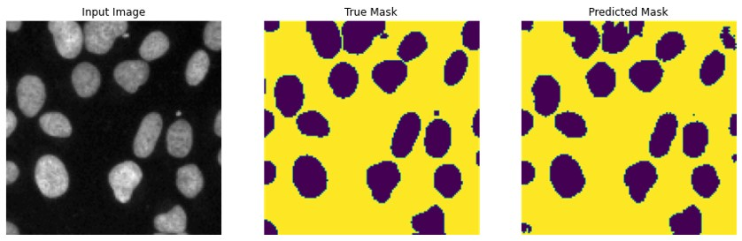

# Nuclei identification using Image segmentation
Goal is to perform image segmentation on <a href="https://www.kaggle.com/c/data-science-bowl-2018">Data Science Bowl 2018</a> data. The dataset is already split into train and test set. The train set is later further split into train and validation sets with ratio of 80:20.

#### Example of original data

### Model Architecture
- Modified U-Net like architecture is build using MobileNetv2 as the base encoder layer.
- Upsampler (decoder) part of the model consist of 4 Conv2DTranspose + BatchNormalization + ReLU layers initialized through tensorflow_examples.models.pix2pix.upsampler() function. Each layer is initialized with filters of size 3x3 with:
  - Upsample Layer 1: 512 filters
  - Upsample Layer 2: 256 filters
  - Upsample Layer 3: 128 filters
  - Upsample Layer 4: 64 filters
- Skip connections are constructed between layers from the encoder layers with the decoder layers.
- Model is set to trained for 100 epochs, with batch size 16. However, early stopping callback is applied, training stopped at epoch 24.
- Best accuracy (0.96804) is obtained at epoch 19. Saved best model is accessible from `/saved_model`.
- Tensorboard can be viewed live <a href="https://tensorboard.dev/experiment/MXhDV4j2RkW4mwXBlSmpVA/">here</a>.

#### Model architecture summary
</img>
#### Prediction at end of epoch 1
</img>
#### Prediction at end of epoch 5
</img>
#### Prediction at end of epoch 10
</img>
#### Prediction at end of epoch 15
</img>
#### Prediction at end of epoch 20
</img>
#### Prediction at end of model training
</img>
#### Accuracy
</img>
#### Loss
</img>
